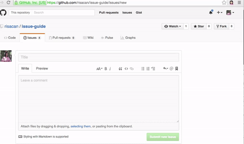
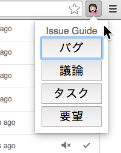
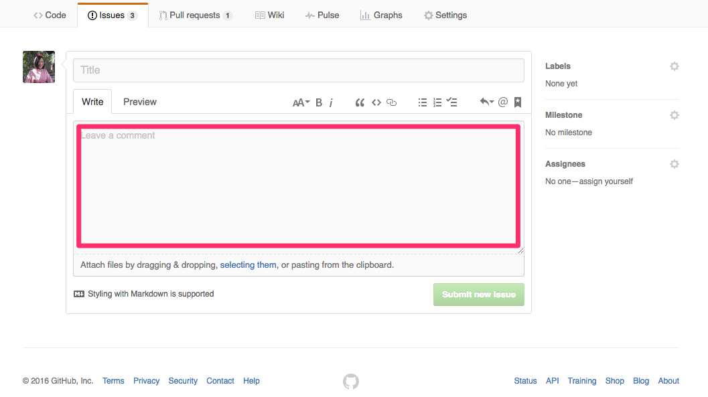

# UX OJT 2016
## Chrome Extensionを作ろう！


## はじめに（スキップしていいです）
当社では開発にGitHubを使っています。
新サービスのILB（SSL終端可能なロードバランサーサービス！）の開発ではGitHubのIssueを使ってタスクの整理や議論が行われています。

視認性向上のため、Labelでのカテゴリ分けだけでなく、タイトルに [タスク] [議論] [バグ] [要望]といったプレフィックスをつけて運用しています。

Issueでの開発の運用で課題となっていたのが、「必要な情報が書かれていない」というものでした。
例えばバグ  を発見した環境の書き忘れ、 Issueのクローズ条件の書き忘れなどです。これが書かれていないと、Issueを回された相手が毎回Issueの作者に詳細の確認をしなければならず効率的ではありません。

そのような「必要な情報の書き忘れ」を防止するための[TRY](http://kuranuki.sonicgarden.jp/2013/05/kpt.html)として、
カテゴリごとにIssueのテンプレートを決めて、Wikiのテンプレート専用のページにリンクを貼っていました。
（参考 [GitHub Issueはテンプレート化で、綺麗に書かせる！](http://qiita.com/yoshimikeisui/items/3e1873e3bf1bbafe8733) ）
しかしながらこの方法だと、テンプレートごとに別のURLを指定しているためリンクが複数必要だし、Issue化するべきことをひらめいた時に一旦プロ ジェクトのレポジトリのWikiにとんで、そこからIssueのテンプレートを探してという無駄なクリックがかかってしまっていました。また、新しいテン プレートを追加するときに、％記号でテンプレートを挿入するのがちょっと面倒だなとおもっていました 。


別の方法として、GitHubの[ISSUE_TEMPLATE.md](https://github.com/blog/2111-issue-and-pull-request-templates)という機能を使う手もあるのですが、1つのレポジトリに対して1つのテンプレートしか設定できないので、カテゴリごとのテンプレートを作成することができません。
そこで、GitHub上でIssueのテンプレートを挿入できるChrome extensionを作ろうと考えました。

# 環境
[GitHub](github.com)のアカウント、[Google Chrome](https://www.google.co.jp/chrome/browser/desktop/)のダウンロードをしてください。
[ここ](https://github.com/risaharada/ojt-issue-guide/)からフォルダをダウンロードしてください。

# manifest.jsonを書く
まずはじめにmanifest.jsonを書きます。
chrome extensionを作るにはまずmanifest.jsonが必要です。
jsonの書き方がわからない方はこちらを参考にしましょう。
最終的に出来たjsonファイルはこちらです。
ダウンロードしたソースを開いて設定を追加していきましょう

```json
{
  "manifest_version": 2,
  "name": "Issue Guide",
  "description": "GitHub Issueのテンプレートを挿入します",
  "version": "1.0",
  "icons": {
    "48": "images/icons/icon_48.png"
  },
  "browser_action": {
    "default_icon": {
      "19": "images/icons/icon_19.png"
    },
    "default_title": "Issue Guide",
    "default_popup": "./popup/index.html"
  },
  "author": "risacan",
  "content_scripts": [
    {
      "matches": [
        "https://github.com/*/*/issues/new"
      ],
      "js": ["./lib/jquery-3.0.0.min.js", "./backend/index.js"]
    }
  ],
  "permissions": [
    "tabs"
  ]
}

```

## manifest_version
manifestfileのバージョンのことです。現在は2と書かないと動きません。
なので、この行なにがどうあっても "manifest_version": 2 になります。
2は数字の2のことなので "" をつけないでください。

## name
Extensionの名前を書きます。
私の場合、名前を"Issue Guide"としたいので、 jsonでは `"name": "Issue Guide"`と書きます。
"Hello World"という名前にしたければ `"name": "Hello World"` と書きます。

## description
Extensionの説明を書きます。

## version
Extensionのバージョンを決めます。
バージョンの表記の方法のひとつに[セマンティックバージョニング](http://semver.org/lang/ja/)があります。参考にしてみましょう :tada:

## icons
アイコンとして使う画像を置きます。大きさは3つありますが全てに設定する必要はありません。
`{"icons": {"48": "images/icons/icon_48.png}}`といったようにアイコン画像へのパスを書きます。
縦横48pxのアイコンを作成して、"issue-guide/images/icons" フォルダに入れてみましょう。

## browser_action
今回作るのはbrowser actionという種類のエクステンションなので、この項目を記述します。

## default_icon
ブラウザ上のナビゲーションバーに表示させるアイコンを設定します。
`"19": "images/icons/icon_19.png"`
縦横48pxのアイコンを作成して、"issue-guide/images/icons" フォルダに入れてみましょう。

## default_title
タイトルを設定します
` "default_title": "Issue Guide"`

## default_popup
ブラウザ上のナビゲーションバーのアイコンをクリックした際にポップアップする部分のhtmlへのパスを記述します
`"default_popup": "./popup/index.html"`

## author
作者名を入れます
`"author": "risacan"`

## content_scripts
このExtensionで使うjsやcssのパスや、このExtensionを適用するURLを記述します

## matches
Extensionを適用させるURLのパターンを記述します。
このExtensionはGitHubで新規Issueを立ち上げたときにだけ動作させたいので、`"matches": ["https://github.com/*/*/issues/new"]`というように記述します。複数のパターンを当てたい場合は"matches": ["ひとつめ", "ふたつめ"] と言った具合に配列の中に記述します。

## js
Extensionで使用するjava scriptファイルへのパスを記述します。
jQueryというライブラリと、開いているタブのDOMを操作するためのjsを指定しました。
`"js": ["./lib/jquery-3.0.0.min.js", "./backend/index.js"]`

自分の書いたjsファイルと、jsのライブラリを区別するためにlibディレクトリとbackendディレクトリでファイルの置き場所を分けています。

## permissions
ChromeのAPIを使うために必要な権限をここに記述します。
今回は"chrome.tabs.sendMessage"というAPIを使います。
https://developer.chrome.com/extensions/tabs
どのような権限をもらえばいいのかはドキュメントに記載されています。
`permissions": ["tabs"]`

# jQueryとは
jQueryはライブラリの一つです。
ライブラリとは、便利なプログラムをいろいろなところで使うための仕組みです。
jQueryはDOMを簡単に操作できるようになるライブラリです。
DOMとはhtmlの(各要素にアクセスする仕組み)[http://piyo-js.com/05/dom.html]のことです
jQueryを使って、GitHubIssueの作成画面で本文を書く部分の要素を書き換えたいと思います。

## 導入
https://jquery.com/
こちらで最新版のjQueryをダウンロードします
"Download the compressed, production jQuery 3.0.0"をクリックします。
libディレクトリにダウンロードした"jquery-3.0.0.min.js"というファイルをおきます。
manifest.jsonのjsの欄にダウンロードした"jquery-3.0.0.min.js"へのパスを書き込みます。
`"js": ["./lib/jquery-3.0.0.min.js", "TODO"]`

# popupを表示させる
popup(ブラウザ上のアイコンを押すと吹き出しのように表示される部分)に簡単なhtmlを作成して表示させてみます。
"issue-guide/popup/index.html" を以下のように編集してみましょう

```html
<!doctype html>
<html>
  <head>
    <meta charset="utf-8">
    <title>Chrome Extension Example</title>
    <script src="../lib/jquery-3.0.0.min.js"></script>
    <link rel="stylesheet" href="./index.css">
  </head>
  <body>
    <header class="title">Issue Guide</header>
  </body>
</html>

```

次に、issue-guide/popup/index.css"を以下のように編集してみましょう

```css
html {
  font-size: 62.5%;
}
.title {
  font-size: 1.6rem;
  color: red;
}
```

Extensionを実際にChromeに載せてみましょう
1. Google chromeのアドレスバーに "chrome://extensions" といれて、開きます
2. デペロッパーモードをチェックして "パッケージ化されていない拡張機能を読み込む" をクリックします
3. 開発中のフォルダを選択します

ブラウザの右上に設定したアイコンとポップアップが表示されれば成功です！



## :sparkles: Advanced
`color: red;`の部分を、 `color: #447741;` と書き換えて保存し、 "chrome://extensions" に戻ってextensionを更新します。
するとポップアップの文字が緑色になります！
[いろいろなカラーコードを指定してみましょう](https://blog.codecamp.jp/color_pattern)

# ボタンを実装する
"issue-guide/popup/index.html" を以下のように編集してみましょう

```html
<!doctype html>
<html>
  <head>
    <meta charset="utf-8">
    <title>Chrome Extension Example</title>
    <script src="../lib/jquery-3.0.0.min.js"></script>
    <link rel="stylesheet" href="./index.css">
  </head>
  <body>
    <header class="title">Issue Guide</header>
    <button class="button">ボタン</button> <!--追加-->
  </body>
</html>

```

"chrome://extensions" に戻ってextensionを更新します。
するとポップアップの部分にボタンが表示されていると思います。

GitHub上のIssue作成ページを開いている時に、ポップアップのこのボタンを押すと、
この部分に予め用意してあった文章を入れる、というふうにしたいです。


jQueryを使ってページのパーツを書き換えるには、書き換えたい箇所のid名を知る必要があります。
そのid名を使って 「このid名を持っている箇所に文字列を入れる」という指示をだすためです。
書き換えたい箇所のidを知るには、Chrome上で書き換えたい箇所にカーソルをクリックして右クリックし、検証をクリックします。
すると、Chromeの機能であるデベロッパーツールが開いて、その要素についてのソースコードを示してくれます。
ハイライトされている部分のコードをよーくみて :eyes: "id"と書いてある箇所を探します。
`id="issue_body"`と書いてあるのがわかりましたか？

 **ポップアップのボタンを押したら、開いているタブの中でidが"issue_body"となっている部分の文章を書き換える**

 という処理を、Java Scriptで書いていくことになります。

# Java Scriptでissueテンプレートを挿入する
Java Scriptを使うための準備をします。
"popup/index.html" の `</body>` の直前に以下のコードを追加します。
また、ボタン部分のコードを編集します。
```html
<!doctype html>
<html>
  <head>
    <meta charset="utf-8">
    <title>Chrome Extension Example</title>
    <script src="../lib/jquery-3.0.0.min.js"></script>
    <link rel="stylesheet" href="./index.css">
  </head>
  <body>
    <header class="title">Issue Guide</header>
    <button id="bug">バグ報告</button> <!--編集-->
    <script src="./index.js"></script> <!--追加-->
  </body>
</html>

```

"popup/index.js"を次のように編集します。
```js
var tabId = 0;
chrome.tabs.query({active: true, currentWindow: true}, function(tabs) {
  tabId = tabs[0].id
});

$(window).on("load", chrome.tabs.reload())

$("#bug").on("click", function () {
  var body = "# 事象\n\n# 環境\n\n# 原因\n\n# 対応\n\n# Close条件\n\nbug fixがマージされる"
  chrome.tabs.sendMessage(
    tabId,
    {
      title: title,
      body: body
    },
    function(response) {}
  )
});
```

"backend/index.js"を次のように編集します
```js
chrome.runtime.onMessage.addListener(
  function (request, sender, sendResponse) {
    $("#issue_body").val(request.body)
  }
)

```

"chrome://extensions" に戻ってextensionを更新し、Issue作成のページに移動して、ポップアップのボタンをクリックしてみてください！
期待したとおりに動きましたか？
期待したとおりに動かなかった場合は、タイプミスやカッコの閉じ忘れ、パスの指定が間違っていないかどうか確認しましょう。
難しかったり、面倒だったりした場合はすぐに誰かに助けを求めましょう！ :tada:
最終的なコードは[こちら](https://github.com/risacan/issue-guide)にあります。

# 参考
[LGTMでめでたさを伝えるChrome拡張をつくった](http://blog.monochromegane.com/blog/2013/12/23/lgtm-chrome-extension/)


[Chromeのオリジナル拡張機能を開発しよう（ソースコードあり）](http://liginc.co.jp/web/tool/browser/163575)
